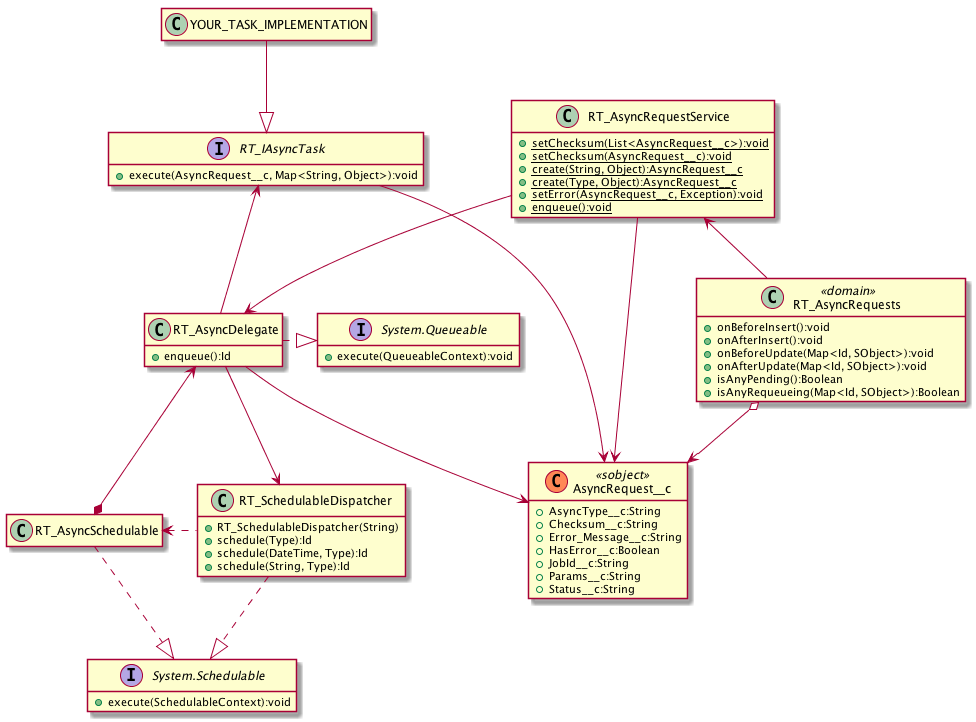

# apex-async

[](https://githubsfdeploy.herokuapp.com)
[](https://travis-ci.org/redteal/apex-async)
[](https://coveralls.io/github/redteal/apex-async?branch=master)

An abstraction for asynchronous Apex implementations in Salesforce.

[](https://raw.githubusercontent.com/redteal/apex-async/master/docs/async-uml.png)

## Example

```java
public class FooAsyncTask implements RT_IAsyncTask {
	public void execute(AsyncRequest__c asyncRequest, Map<String, Object> params) {
		System.debug(params.get('i'));
	}
}
```

```java
List<AsyncRequest__c> reqs = new List<AsyncRequest__c>();
for (Integer i = 0; i < 50; i++) {
	Map<String, Object> params = new Map<String, Object> {'i' => i};
	reqs.add(RT_AsyncRequestService.create(FooAsyncTask.class, params));
}
insert reqs;
```

Insertion of `AsyncRequest__c` triggers the task to be queued for processing.
